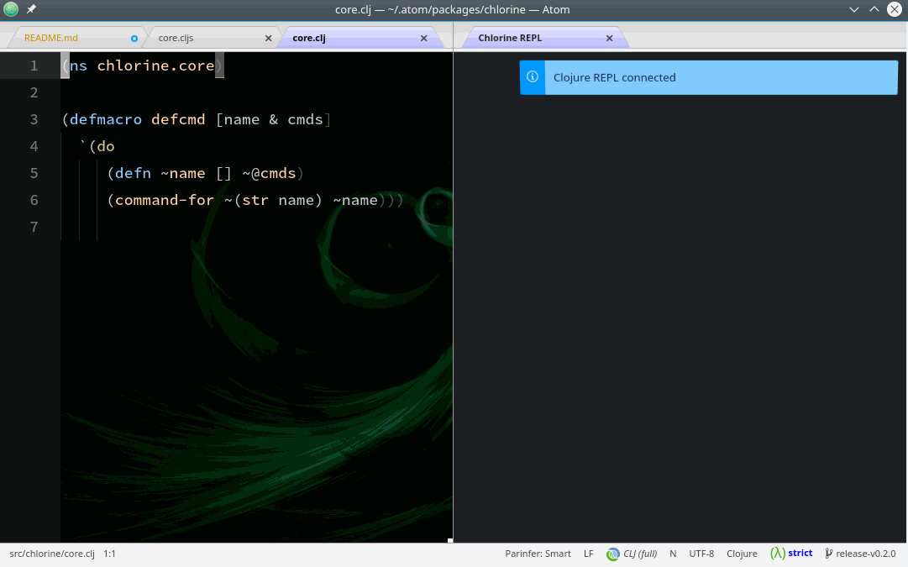

# Chlorine
[](https://circleci.com/gh/mauricioszabo/atom-chlorine)

Cl + Atom = Chlorine

Socket-REPL integration with Clojure and ClojureScript with Atom.

This project also have a [FAQ](https://github.com/mauricioszabo/repl-tooling/blob/master/doc/FAQ.md) now

## Example
Chlorine connects to a Socket REPL and adds autocomplete, goto var definition, evaluation, refresh, and documentation of functions on Atom. It can also add additional things, so check it out on [extending Chlorine](docs/extending.md). The idea of the project is to give Atom a felling of being completely connected to running code that's being developed, like SmallTalk images but still working with textual source codes, git, and every other tool that we already use with our code.



As it is possible to see above, Chlorine works both with Clojure and ClojureScript (only shadow-cljs for now).

## Usage:

>If you are a beginner, you may check this [quickstart guide](docs/quickstart.md).

Fire up a clojure REPL with Socket REPL support. With `shadow-cljs`, when you `watch` some build ID it'll give you a port for nREPL and Socket REPL. With `lein`, invoke it in a folder where you have `project.clj` and you can use `JVM_OPTS` environment variable like (on Linux or MacOS):

```bash
JVM_OPTS='-Dclojure.server.myrepl={:port,5555,:accept,clojure.core.server/repl}' lein repl
```

On Windows, you can add a profile on `project.clj` that will add these JVM options; to do it, check if your `project.clj` have the `:profiles` key. If it does, just add the `:socket` part, if it does not, add the `:profiles` tag and then the `:socket`:

```clojure
  ; ... dependencies, main, etc ...
  :profiles {:socket {:jvm-opts ["-Dclojure.server.myrepl={:port,5555,:accept,clojure.core.server/repl}"]}}
```

Then, you can run `lein with-profile +socket repl`, and it'll open a Socket REPL on port `5555`.

On Shadow-CLJS' newer versions, when you start a build with `shadow-cljs watch <some-id>`, it doesn't shows the Socket REPL port on the console, but it does create a file with the port number on `.shadow-cljs/socket-repl.port`. You can read that file to see the port number (Chlorine currently uses this file to mark the port as default).

With `clj`, you can run the following from any folder:

```bash
clj -J'-Dclojure.server.repl={:port,5555,:accept,clojure.core.server/repl}'
```

Or have it in `:aliases` in `deps.edn`. (For an example with port 50505 see https://github.com/seancorfield/dot-clojure/blob/master/deps.edn, then you can run `clj -A:socket`.)

Then, you connect Chlorine with the port using the command _Connect Clojure Socket REPL_. This package works with lumo too, but you'll need to run _Connect ClojureScript Socket REPL_.

When connected, it'll try to load `compliment` and `org.clojure/tools.namespace` (for autocomplete and refresh). Then you can evaluate code on it, and it'll render on a block decoration below the line.

## Keybindings:
This package does not register any keybindings to avoid keybinding conflict issues. You can define whatever you want via keymap.cson. The following have worked for some people:

**If you use vim-mode-plus:**
```cson
'atom-text-editor.vim-mode-plus.normal-mode[data-grammar="source clojure"]':
  'g f':          'chlorine:go-to-var-definition'
  'ctrl-d':       'chlorine:doc-for-var'
  'space c':      'chlorine:connect-socket-repl'
  'space l':      'chlorine:clear-console'
  'shift-enter':  'chlorine:evaluate-block'
  'ctrl-enter':   'chlorine:evaluate-top-block'
  'ctrl-c':       'chlorine:break-evaluation'
  'space space':  'chlorine:clear-inline-results'
  'space x':      'chlorine:run-tests-in-ns'
  'space t':      'chlorine:run-test-for-var'

'atom-text-editor.vim-mode-plus.insert-mode[data-grammar="source clojure"]':
  'shift-enter': 'chlorine:evaluate-block'
  'ctrl-enter': 'chlorine:evaluate-top-block'
```

**If you don't use vim bindings:**
```cson
'atom-text-editor[data-grammar="source clojure"]':
  'ctrl-; y':       'chlorine:connect-socket-repl'
  'ctrl-; e':       'chlorine:disconnect'
  'ctrl-; k':       'chlorine:clear-console'
  'ctrl-; f':       'chlorine:load-file'
  'ctrl-; b':       'chlorine:evaluate-block'
  'ctrl-; B':       'chlorine:evaluate-top-block'
  'ctrl-; i':       'chlorine:inspect-block'
  'ctrl-; I':       'chlorine:inspect-top-block'
  'ctrl-; s':       'chlorine:evaluate-selection'
  'ctrl-; c':       'chlorine:break-evaluation'
  'ctrl-; S':       'chlorine:source-for-var'
  'ctrl-; d':       'chlorine:doc-for-var'
  'ctrl-; x':       'chlorine:run-tests-in-ns'
  'ctrl-; t':       'chlorine:run-test-for-var'
```
## How to work with ClojureScript
For now, it only works with Shadow-CLJS or ClojureScript implementations like Lumo or Plank that exposes a ClojureScript socket REPL.

With Lumo, you fire up lumo with `lumo -n 3322` to start a socket REPL on port `3322` (or any other port), then connect Chlorine with "Connect ClojureScript Socket REPL".

With Shadow-CLJS, after watching (or after starting a server, or anything that starts a socket REPL) you connect with "Connect Clojure Socket REPL", then run the command "Connect Embedded". Then you can run code on .cljs files too.

> ### WARNING
> Do not evaluate the `ns` form in Shadow-CLJS. Shadow keeps your namespaces reloaded all the time, and sometimes re-evaluating then can lead to strange issues. If you **do evaluate** the ns form and get errors, just save the current file and Shadow will hot-reload it, and things will be fine. For more info, see: https://github.com/mauricioszabo/atom-chlorine/issues/213

### Detection
Chlorine will try to detect the current file extension, falling back to `.clj` if the file is not saved. With ClojureScript, it'll only evaluate `.cljs` files, and it'll use the Clojure REPL to evaluate `.clj` and `.cljc` files. You can override this behavior in the package's configuration to one of the following:

* Prefer CLJ - The default configuration, will use the Clojure REPL to evaluate `.clj` and `.cljc` and it'll use the ClojureScript REPL to evaluate `.cljs`
* Prefer CLJS - It will use the Clojure REPL to evaluate `.clj` and the ClojureScript REPL to evaluate `.cljc` and `.cljs`
* CLJ - It'll use the Clojure REPL to evaluate all files
* CLJS - It'll use the ClojureScripte REPL to evaluate all files

## How to contribute?
As Chlorine is in active development, it was starting to become tedious to publish a newer version of repl-tooling for every experiment, so for now, the library is registered as a submodule. To contribute, you clone this repository and run:

```
./scripts/setup
```

To register the submodule. More info on [Developing](docs/developing.md) document.
