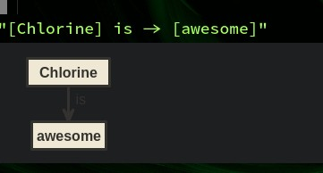

# Custom Renderers

Since version 0.7.2, Chlorine supports "Custom Renderers". Combined with interactive results, it allows the user to integrate Javascript libraries that graphically render elements on the screen. On this example, I'll integrate http://www.nomnoml.com/ library (that renders diagrams on the screen). This is an example on how to run nomnoml:

```js
var nomnoml = require('nomnoml');
var src = '[nomnoml] is -> [awesome]';
console.log(nomnoml.renderSvg(src));
```

So, in Chlorine, we'll want to render something like this:

```clojure
[:p/nomno "[Chlorine] is -> [awesome]"]
```

And then the diagram will be rendered on the editor.


So, to register a diagram, you'll run the command `Chlorine: Open Config`, and then add the following code:

```clojure
(def ^:private render-svg (render/js-require "./chlorine/nomno"))
(defn- diag [txt]
  (doto (render/create-tag "div")
   (render/set-html (render-svg txt))))
(render/register-tag :p/diag diag)

(defn render-diagram []
  (p/let [contents (editor/get-top-block)
          contents (update contents :text #(str "{:html [:p/diag "
                                                %
                                                "]}"))]
    (editor/eval-interactive contents)))

```

Now, you'll need to prepare the `chlorine/nomno` code. It's just a single javascript with a single line, but it's a good practice to not add `node_modules` directory in the Atom's config root directory. So, what you need to do is go to the Atom's configuration directory (if you don't know where it is, just locate, on Chlorine's config file, at the bottom left corner, the file name. It'll probably be something like `~/.atom/chlorine-config.cljs`. You can click this file, and it'll copy the full path of the file - including the directory, so you can just enter this directory over a terminal), and there create a folder called `chlorine`. Inside this `chlorine` folder, run `npm install nomnoml`, and then create the `nomno.js` file with the following content:

```js
module.exports = require('nomnoml').renderSvg;
```

This just wires up the library, and then it's possible to run "Chlorine: Render Diagram" on a normal Clojure String, and it'll render the string as a nomnoml diagram.



About any JS library can be used as a custom render, provided that it works on Node.JS (and is able to be required with Node.JS' `require` command.
