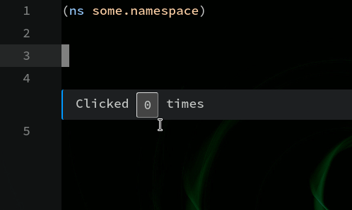
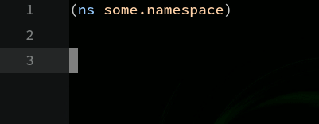

# Extending Chlorine

It is possible to add support for additional commands not included on Chlorine. Atom supports init scripts where you can configure more commands, change the behavior of the editor, and so on. To do so, just run "Open your Init Script" on the editor's command pallete and you'll se or a Javascript or a CoffeeScript file, where you can use the Atom API to add commands, change behaviors, etc.

There's also an experimental feature to add commands to Chlorine in ClojureScript (using the great [Simple Clojure Interpreter - sci](https://github.com/borkdude/sci/)). If you run `Chlorine: Open Config`, it'll open an empty ClojureScript file for you to add commands to Chlorine. Any "public" `defn` added on this file will be converted to a Chlorine command.

## Extending from ClojureScript

See also: [Custom Renderers](custom-renderers.md)

First you'll run `Chlorine: Open Config`. Then, on this file, you'll add functions that will be converted to `Chlorine: ....` commands. For example, to add a command to explain a prismatic schema:

```clojure
(defn explain-schema []
  (p/let [editor-data (editor/get-var)]
    (when editor-data
      (-> editor-data
          (update :text #(str "(if (satisfies? schema.core/Schema " % ") "
                                  "(schema.core/explain " % ")"
                                  "(or (:schema (meta (ns-resolve *ns* '" % ")))"
                                       "\"Is not a schema\"))"))
          (editor/eval-and-render)))))
```

Example of the above code running:


Please, notice that `p/let` is being used instead of `let`: the reason is that some commands on Chlorine's side return Javascript's promises, and `p/let` is able to "wait" for then before running the next bindings.

The current (incomplete) API is:
* `get-top-block`, `get-block`, `get-var`, `get-selection` - Return the current text refering to top-block, block, current Clojure var, or selection. Will return a map with `:text`, a string containing the current text, an `:range`, a 0-based `[[start-row start-col] [end-row end-col]]` that corresponds to the start and end of the selection/block/var.
* `get-namespace` - returns the current namespace, with the same format as the above commands. Please notice that while `:text` refers to a string with the current namespace name, `:range` corresponds to the full namespace range - so, it'll include `:require`, `:import`, and so on.
* `eval-and-render` - will evaluate the current code, and render it on the editor. Expects a map with `:text` (the current code to be evaluated) and `:range` (the place where the evaluation inline result will be rendered).
* `eval-interactive` - exactly the same as `eval-and-render`, but expects and interactive result. Interactive results are covered ahead on this documentation.

## Extending from Atom's init.coffee or init.js

To add a command on the editor, you first need to wait for the package to activate. Then, you need to pick up the main module, and there's a property that contains code that is meant to be extended. This works better with an example: suppose you want to add support for Prismatic Schema: you want to describe the Schema that currently is under the cursor. You can do that with the following sequence of commands (example in Javascript, please convert to CoffeeScript if necessary):

```javascript
// This waits for the package to load
atom.packages.activatePackage('chlorine').then(package => {
  // This picks up the "main module" of the package
  const pkg = package.mainModule

  // This will add a command called "chlorine:explain-schema". You can check
  //it on the command pallete
  atom.commands.add('atom-text-editor', 'chlorine:explain-schema', function() {
    // pkg.ext.get_var() gets the current var under the cursor. There's also
    //pkg.ext.get_block() and pkg.ext.get_top_block()
    const result = pkg.ext.get_var()
    // Need to check if the current cursor position points to a valid Clojure
    // var or points to whitespace, comments, etc
    if(result.text) {
      // Interpolate command with Prismatic Schema's explain code
      const cmd = `
        (if (satisfies? schema.core/Schema ${result.text})
        (schema.core/explain ${result.text})
        (or (:schema (meta (ns-resolve *ns* '${result.text})))
        (clojure.edn/read-string (clojure.repl/source-fn '${result.text}))))`
      // This line will run the code, and present on the screen, the same way
      // that we evaluate commands. We need the command to evaluate, and the
      // current range so Chlorine knows where to put the result
      pkg.ext.evaluate_and_present(cmd, result.range)
    }
  })
})
```

There's only ONE api that's supported only by Atom's `init.js` or `init.coffee` and not by ClojureScript, that's the ability to connect to a Socket REPL without using the popup UI. To do so, the same rules apply: you have to wait for the package to activate, then register a command that will connect to a specific host/port:

```javascript
atom.packages.activatePackage('chlorine').then(package => {
  // This picks up the "main module" of the package
  const pkg = package.mainModule

  atom.commands.add('atom-workspace', 'chlorine:connect-on-5555-port', () => {
    pkg.connect_socket('localhost', 5555)
  })
})
```

### API

Once you've got the package's `mainModule`, inside `.ext` there are the following commands to help you extend functionality:

* `pkg.ext.get_top_block()` will get the current top block of the active text editor.
* `pkg.ext.get_block()` will get the current block. Please notice that `#(+ 1 2)` will return the anonymous function, not the `(+ 1 2)` and getting top block of `@(:some value)` will deref that current value (but `(deref (:some value))`, if your cursor is pointed inside `:some`, for example, will return the atom).
* `pkg.ext.get_var()` will get the current var under the cursor. If the editor's position is over a parenthesis, will get the whole form
* `pkg.ext.get_selection()` will get the current selection in the current editor. Please notice that it may be not a valid Clojure code
* `pkg.ext.get_namespace()` will get the current namespace name, with the full range of it.

All the above commands return `{text: string? range: array?}`. If both are `null`, it means that the current cursor position/selection does not point to a valid Clojure form or var (maybe it's a whitespace, or maybe it's inside a comment, for example). If one is present, the other will be present too.

`range` is a 2x2 array containing: `[[startRow, startCol], [endRow, endCol]]`. If both start and end are equal, it means that there's nothing selected. It is also 0-based, which means that the first line is `0`, the second is `1`, and so on; the same is true for columns - the first one is `0`, the second one is `1`, etc.

* `pkg.ext.evaluate_and_present(code, range)` will evaluate the `code`, inside the current `range`, and it'll render on the screen. It expects the code to evaluate, and the current range (so it knows where to render on the screen).
* `pkg.ext.evaluate_interactive(code, range)` will evaluate the `code`, inside the current `range`, and it'll render on the screen, using the "interactive renderer". It als expects the code to evaluate, and the current range (so it knows where to render on the screen).

## Interactive results

Chlorine also supports "interactive results". The idea is to hook up on Reagent commands and be able to render arbitrary HTML, rendered based on a "state" `atom`. When you change that state, the page will react accordingly.

To render an interactive result, you must render a map that contains, at least, `:html` key. That key will be interpreted as a Hiccup format, using [reagent](http://reagent-project.github.io/) library. For example, suppose you want to add a command that, when you evaluate a code, it'll not evaluate anything and just return the code on the result:

**In ClojureScript**:
```clojure
(defn re-print []
  (p/let [res (editor/get-block)]
    (when res
      (-> res
          (update :text #(str "{:html (pr-str (quote " % "))}"))
          (editor/eval-interactive)))))
```

**In Javascript**:
```javascript
atom.packages.activatePackage('chlorine').then(package => {
  const pkg = package.mainModule

  atom.commands.add('atom-text-editor', 'chlorine:re-print', function() {
    const result = pkg.ext.get_block()
    if(result.text) {
      const cmd = `{:html (pr-str (quote ${result.text}))}`
      pkg.ext.evaluate_interactive(cmd, result.range)
    }
  })
})
```

When you evaluate this code, you can have a result like this one:


But the interesting part is that you can send `:state` and `:fns` keys to the interactive renderer, and it'll bind variables to you: `?state` will be the "current state" of the app, and every keyword you bind on the `:fns` map will be transformed into a function that you can call. So, for example, suppose you want to render a "counter" button, one that when you click, it'll update the current counter by one. The full code is the following (you can copy-paste it on the Devtools, in Atom, to evaluate it):

**In ClojureScript**:
```clojure
(defn counter []
  (editor/eval-interactive
   {:text (str ''{:html [:div "Clicked "
                         [:button {:on-click ?incr} ?state]
                         " times"]
                  :state 0
                  :fns {:incr (fn [_ s] (inc s))}`})
    :range [[3 0] [3 0]]}))
```

**In Javascript**:
```js
pkg = atom.packages.getActivePackage('chlorine').mainModule
pkg.ext.evaluate_interactive(`
  '{:html [:div "Clicked " [:button {:on-click ?incr} ?state] " times" ]
    :state 0
    :fns {:incr (fn [_ s] (inc s))}}`
  , [[3, 0], [3, 0]]
)
```

This will render, just below line 4 (the `3` on the range part), the following HTML:



To explain each phase:
1. Everything is quoted - this is because the code will be evaluated to return the `:html`-containing map. If you didn't quote it, it'll try to evaluate `?state`, for example, and evaluation will fail
1. `?state` will be bound to the `:state` key, and it'll be passed as second parameter to callback functions
1. `:fns` is a map. In this case, it have only one key: `:incr`. This will bind the `?incr` variable to this function. It receives two parameters: the current element's data, and the current state. It needs to return a new state, and the page will react accordingly. Each callback can also receive more parameters, so you can configure everything

So, a more complex example: in this new one, we'll bind the `?hello` function to one that will receive an additional parameters (in our case, it'll always be `"Hello") and we'll use the current element's data in our callback:

**In ClojureScript**:
```clojure
(defn hello []
  (editor/eval-interactive
   {:text (str ''{:html
                  [:div.rows
                   [:div [:input {:type "text"
                                  :on-change (?hello "Hello")
                                  :value (:in ?state)}]]
                   [:div (:msg ?state)]]
                  :state {:in "" :msg "Type Something..."}
                  :fns {:hello (fn [e s prefix]
                                 (assoc
                                  s
                                  :in (:value e)
                                  :msg (str prefix ", " (:value e))))}})
    :range [[3 0] [3 0]]}))
```

**In Javascript**:
```js
pkg.ext.evaluate_interactive(`
  '{:html [:div.rows
          [:div [:input {:type "text" :on-change (?hello "Hello") :value (:in ?state)}]]
          [:div (:msg ?state)]]
   :state {:in "" :msg "Type Something..."}
   :fns {:hello (fn [e s prefix] (assoc s
                                        :in (:value e)
                                        :msg (str prefix ", " (:value e))))}}`
  , [[1, 0], [1, 0]]
)
```

The code above will render the result below, just after the second line:


